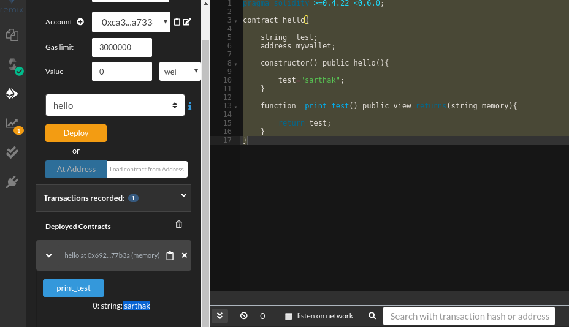
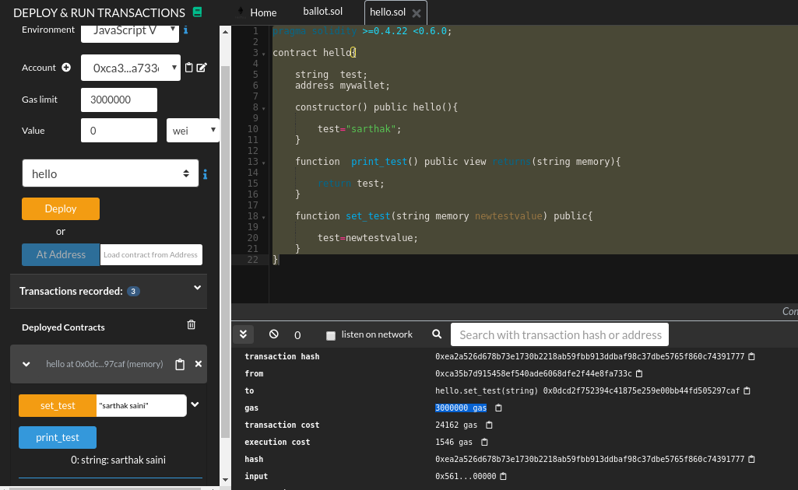

# PART 2 - Series of Creating Blockchain based C2

**Links Which would be necessary for this Section of series**

* [Remix](https://remix.ethereum.org/)
* [Dapp University](https://www.youtube.com/watch?v=MnSmc7Hto2k&list=PLS5SEs8ZftgUq-aMMYeKf8nPqHrNqa3Iu)

## Introduction to Solidity

As we have already briefed about the what is solidity so we will Directly dive into the Coding part

```
pragma solidity >=0.4.22 <0.6.0;
```

This is how we have to initialise the solidity program by writing down the version we will be using in our script.

We start off the contract by using  *contract* keyword with the contract name...

Example:-

```
contract HelloWorld {
	//code
  }
```


## Data Type

*Another Note:- I will only talk about the relevant data types for c2*

* Address :- This data type will store the wallet addresses passed to it.
* string :- This data type is self explanatory..stores string


Example:-

```
pragma solidity >=0.4.22 <0.6.0;

contract hello{
    
    string  test;
    address mywallet;
}
```

To test this program go to the **remix website** whose link is given in the beginning of this article and create a file with `.sol` extension But this program will not give any output yet so let's move ahead.


## Constructor and Functions

Constructors is basically a function which executes as soon as contract is deployed.

To create a constructor the syntax is ...

```
constructor() public <contract name>(){

}
```

For example to assign some values to my previously created string `test` we would use constructor

```
pragma solidity >=0.4.22 <0.6.0;

contract hello{
    
    string  test;
    address mywallet;
    
    constructor() public hello(){
        
        test="sarthak";
    }
}
```


Now we would discuss functions in order to print our beloved `test` variable's content...


### Functions

functions which would return a value to the user would have this syntax

```
function <function name> public view returns(string memory){
    return <variable>
}
```


So here we have couple of things to understand such as :-

* **view** :- This basically tells solidity that, this function will not going to add or update any values in blockchain.
* **memory** :- This is a keyword which is being used while either setting or getting a **String** based value.


So now we will print out the test variable's content to the user...

```
pragma solidity >=0.4.22 <0.6.0;

contract hello{
    
    string  test;
    address mywallet;
    
    constructor() public hello(){
        
        test="sarthak";
    }
    
    function  print_test() public view returns(string memory){
        
        return test;
    }
}
```

The Execution and output will look like this...




As we can see sarthak has been printed out .


Now we will Talk about how we can change that test value from `sarthak` to anything else...

For this we will create a function to actually update a value on blockchain but before we proceed do **note that while getting information from a blockchain is free like printing the value of a variable in contract but updating or adding data on contract will Cost as we have to make an transaction**

I will explain this later in this article...

*Syntax for a write function*

```
function <function name>(argument(s) ) public{
    // update the data here
}
```


To update the value of test we would do is 

```
function set_test(string memory newtestvalue) public{
        
        test=newtestvalue;
    }
```

We created a function called `set_test` and passed an argument which is string type called newtestvalue and updated the value of test with it ...pretty simple so final contract would look like this

```
pragma solidity >=0.4.22 <0.6.0;

contract hello{
    
    string  test;
    address mywallet;
    
    constructor() public hello(){
        
        test="sarthak";
    }
    
    function  print_test() public view returns(string memory){
        
        return test;
    }
    
    function set_test(string memory newtestvalue) public{
        
        test=newtestvalue;
    }
}
```


Let's execute this and see what has happened ...




Couple of things to notice that after setting the value to *sarthak saini* we noticed that a transaction cost has incurred and a gas value has generated ..this basically means that to add or change any value on smart contract we have to pay a certain fees (for the miner who is mining our transaction).


For better understanding please check out Solidity Tutorial at Dapp University whose link has been posted in beginning of this article.

 

## Events

Events are basically logging mechanism which triggers a signals which would give a notification to the listening party basically it means it's just like how you subscribed to some email notification or like whenever your fav youtuber uploads a video in which he gives reaction to tiktok videos.


So in the same way all the involved party or listeners would get a notification as soon as the event is triggered..this section is quite hard to explain but i will show its implementation in next part as we also need to build a listener.


Syntax:-

```
event <event name>(argument)
```

Whatever is passed in argument will be logged and sent the argument value to every listener which would later be used by us to listen for response from victim's computer :)

<br/>

In part 3 we will start building our smart contract for our c2.

part 3 is [here](/2019/August/Blockchain/parts/3/contracts.html)
