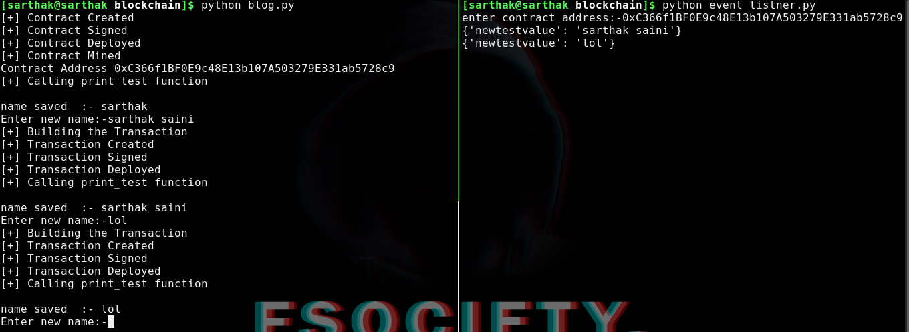

# PART 4 - Series of Creating Blockchain based C2

**Links Which would be necessary for this Section of series**

* [remix](https://remix.ethereum.org/)

## Interaction of Functions in web3.py

Before diving into the code let me remind that to fetch a information from blockchain we don't have to pay any fees or we simply don't have to create any transactions so we'll first create a logic to fetch data then we'll create to save data over blockchain.

### Fetch Data 

For functions we have to create a contract object which will accept 2 arguments

1) Contract Address :- which is part of transaction receipt we generated when the block was mined

2) Abi  

syntax:-

```python
    contract=web3.eth.contract(address=tx_reciept.contractAddress,abi=abi)	
```

After getting the contract object we can just use this syntax to get data 

```python
contract.functions.print_test().call()
```

Things happened here :-

* **functions()** :- this method has all the functions we defined in our solidity contract
* **print_test()** :- this was the function we created to print my name
* **call()** :- this method will execute the function and returns the value received from smart contract

**Final Code:-**

*Note :- I have updated source coded to look a little more presentable as well as wallet_key and private_key are changed now as ganache restarted*

```python
from web3 import Web3

blockchain_server="ws://127.0.0.1:8545"
web3=Web3(Web3.WebsocketProvider(blockchain_server))
abi='[{"constant":false,"inputs":[{"name":"newtestvalue","type":"string"}],"name":"set_test","outputs":[],"payable":false,"stateMutability":"nonpayable","type":"function"},{"constant":true,"inputs":[],"name":"print_test","outputs":[{"name":"","type":"string"}],"payable":false,"stateMutability":"view","type":"function"},{"inputs":[],"payable":false,"stateMutability":"nonpayable","type":"constructor"}]'
bytecode="608060405234801561001057600080fd5b506040805190810160405280600781526020017f7361727468616b000000000000000000000000000000000000000000000000008152506000908051906020019061005c929190610062565b50610107565b828054600181600116156101000203166002900490600052602060002090601f016020900481019282601f106100a357805160ff19168380011785556100d1565b828001600101855582156100d1579182015b828111156100d05782518255916020019190600101906100b5565b5b5090506100de91906100e2565b5090565b61010491905b808211156101005760008160009055506001016100e8565b5090565b90565b610330806101166000396000f3fe608060405260043610610046576000357c0100000000000000000000000000000000000000000000000000000000900480635613a7961461004b578063d5221ec814610113575b600080fd5b34801561005757600080fd5b506101116004803603602081101561006e57600080fd5b810190808035906020019064010000000081111561008b57600080fd5b82018360208201111561009d57600080fd5b803590602001918460018302840111640100000000831117156100bf57600080fd5b91908080601f016020809104026020016040519081016040528093929190818152602001838380828437600081840152601f19601f8201169050808301925050505050505091929192905050506101a3565b005b34801561011f57600080fd5b506101286101bd565b6040518080602001828103825283818151815260200191508051906020019080838360005b8381101561016857808201518184015260208101905061014d565b50505050905090810190601f1680156101955780820380516001836020036101000a031916815260200191505b509250505060405180910390f35b80600090805190602001906101b992919061025f565b5050565b606060008054600181600116156101000203166002900480601f0160208091040260200160405190810160405280929190818152602001828054600181600116156101000203166002900480156102555780601f1061022a57610100808354040283529160200191610255565b820191906000526020600020905b81548152906001019060200180831161023857829003601f168201915b5050505050905090565b828054600181600116156101000203166002900490600052602060002090601f016020900481019282601f106102a057805160ff19168380011785556102ce565b828001600101855582156102ce579182015b828111156102cd5782518255916020019190600101906102b2565b5b5090506102db91906102df565b5090565b61030191905b808211156102fd5760008160009055506001016102e5565b5090565b9056fea165627a7a723058209b6f41504caec9524bd2f9c655f459d69426bbe050387c5e11d2a5b05e45a7310029"
wallet_key="0xACb29D9c72EF7AF7CC99ea78915e576328216647"
private_key="0x398ae6b3781aa0fd1a8e82d5b6ecbdf18b4468203c2efbd08cb7f00846ba46e0"

def create_contract():
    contract_obj = web3.eth.contract(abi=abi,bytecode=bytecode)
    construct_txn = contract_obj.constructor().buildTransaction({
        'from': wallet_key,
        'nonce': web3.eth.getTransactionCount(wallet_key),
        'gas': web3.eth.getBlock('latest').gasLimit,
        'gasPrice': web3.toWei('30', 'gwei')})

    print("[+] Contract Created")
    signed = web3.eth.account.signTransaction(construct_txn,private_key)
    print("[+] Contract Signed")
    tx_hash = web3.eth.sendRawTransaction(signed.rawTransaction).hex()
    print("[+] Contract Deployed")
    tx_receipt = web3.eth.waitForTransactionReceipt(tx_hash)
    if tx_receipt:
        print("[+] Contract Mined")
        get_testvalue(tx_receipt)

def get_testvalue(tx_receipt):
    print("[+] Calling print_test function")
    contract=web3.eth.contract(address=tx_receipt.contractAddress,abi=abi)
    print("\nname saved  :-",contract.functions.print_test().call())         

create_contract()    
```

The output :-

```
[+] Contract Created
[+] Contract Signed
[+] Contract Deployed
[+] Contract Mined
[+] Calling print_test function

name saved  :- sarthak
```

### Set Data

Now that we can successfully retrieve data we will create a function to write data on blockchain and change the `test` value on our smart contract

We will simply create a Transaction like we did previously but this time we will create with the help of contract address and abi as well as we are working for functions not constructor as we did in part 3

syntax :-

```python
construct_txn = contract.functions.set_test("input from user").buildTransaction({
    'from': wallet_key,
    'nonce': web3.eth.getTransactionCount(wallet_key),
    'gas': web3.eth.getBlock('latest').gasLimit,
    'gasPrice': web3.toWei('30', 'gwei')})
```

Things to Notice:-

* **contract.functions.set_test()** :- Here we can see we are working with `set_test` function from solidity and if you recall from part 2 this function actually takes an input so that's where we will pass our user input for the name

*Note :- Rest of the details about this code has been discussed in previous parts so please if you don't understand this code go back to previous part and read again :)*

Final code would look like this :-

```python
from web3 import Web3

blockchain_server="ws://127.0.0.1:8545"
web3=Web3(Web3.WebsocketProvider(blockchain_server))
abi='[{"constant":false,"inputs":[{"name":"newtestvalue","type":"string"}],"name":"set_test","outputs":[],"payable":false,"stateMutability":"nonpayable","type":"function"},{"constant":true,"inputs":[],"name":"print_test","outputs":[{"name":"","type":"string"}],"payable":false,"stateMutability":"view","type":"function"},{"inputs":[],"payable":false,"stateMutability":"nonpayable","type":"constructor"}]'
bytecode="608060405234801561001057600080fd5b506040805190810160405280600781526020017f7361727468616b000000000000000000000000000000000000000000000000008152506000908051906020019061005c929190610062565b50610107565b828054600181600116156101000203166002900490600052602060002090601f016020900481019282601f106100a357805160ff19168380011785556100d1565b828001600101855582156100d1579182015b828111156100d05782518255916020019190600101906100b5565b5b5090506100de91906100e2565b5090565b61010491905b808211156101005760008160009055506001016100e8565b5090565b90565b610330806101166000396000f3fe608060405260043610610046576000357c0100000000000000000000000000000000000000000000000000000000900480635613a7961461004b578063d5221ec814610113575b600080fd5b34801561005757600080fd5b506101116004803603602081101561006e57600080fd5b810190808035906020019064010000000081111561008b57600080fd5b82018360208201111561009d57600080fd5b803590602001918460018302840111640100000000831117156100bf57600080fd5b91908080601f016020809104026020016040519081016040528093929190818152602001838380828437600081840152601f19601f8201169050808301925050505050505091929192905050506101a3565b005b34801561011f57600080fd5b506101286101bd565b6040518080602001828103825283818151815260200191508051906020019080838360005b8381101561016857808201518184015260208101905061014d565b50505050905090810190601f1680156101955780820380516001836020036101000a031916815260200191505b509250505060405180910390f35b80600090805190602001906101b992919061025f565b5050565b606060008054600181600116156101000203166002900480601f0160208091040260200160405190810160405280929190818152602001828054600181600116156101000203166002900480156102555780601f1061022a57610100808354040283529160200191610255565b820191906000526020600020905b81548152906001019060200180831161023857829003601f168201915b5050505050905090565b828054600181600116156101000203166002900490600052602060002090601f016020900481019282601f106102a057805160ff19168380011785556102ce565b828001600101855582156102ce579182015b828111156102cd5782518255916020019190600101906102b2565b5b5090506102db91906102df565b5090565b61030191905b808211156102fd5760008160009055506001016102e5565b5090565b9056fea165627a7a723058209b6f41504caec9524bd2f9c655f459d69426bbe050387c5e11d2a5b05e45a7310029"
wallet_key="0xACb29D9c72EF7AF7CC99ea78915e576328216647"
private_key="0x398ae6b3781aa0fd1a8e82d5b6ecbdf18b4468203c2efbd08cb7f00846ba46e0"

def create_contract():
    contract_obj = web3.eth.contract(abi=abi,bytecode=bytecode)
    construct_txn = contract_obj.constructor().buildTransaction({
        'from': wallet_key,
        'nonce': web3.eth.getTransactionCount(wallet_key),
        'gas': web3.eth.getBlock('latest').gasLimit,
        'gasPrice': web3.toWei('30', 'gwei')})

    print("[+] Contract Created")
    signed = web3.eth.account.signTransaction(construct_txn,private_key)
    print("[+] Contract Signed")
    tx_hash = web3.eth.sendRawTransaction(signed.rawTransaction).hex()
    print("[+] Contract Deployed")
    tx_receipt = web3.eth.waitForTransactionReceipt(tx_hash)
    if tx_receipt:
        print("[+] Contract Mined")
        get_testvalue(tx_receipt)

def get_testvalue(tx_receipt):
    print("[+] Calling print_test function")
    contract=web3.eth.contract(address=tx_receipt.contractAddress,abi=abi)
    print("\nname saved  :-",contract.functions.print_test().call())    
    set_testvalue(contract,tx_receipt)     

def set_testvalue(contract,tx_receipt):
    name=input("Enter new name:-")
    print("[+] Building the Transaction")
    construct_txn = contract.functions.set_test(name).buildTransaction({
    'from': wallet_key,
    'nonce': web3.eth.getTransactionCount(wallet_key),
    'gas': web3.eth.getBlock('latest').gasLimit,
    'gasPrice': web3.toWei('30', 'gwei')})
    
    print("[+] Transaction Created")
    signed = web3.eth.account.signTransaction(construct_txn,private_key)
    print("[+] Transaction Signed")
    tx_hash = web3.eth.sendRawTransaction(signed.rawTransaction).hex()
    print("[+] Transaction Deployed")
    check = web3.eth.waitForTransactionReceipt(tx_hash)

    if check:
        get_testvalue(tx_receipt)

create_contract()   
```


The output :-

```
[+] Contract Created
[+] Contract Signed
[+] Contract Deployed
[+] Contract Mined
[+] Calling print_test function

name saved  :- sarthak
Enter new name:-sarthak saini
[+] Building the Transaction
[+] Transaction Created
[+] Transaction Signed
[+] Transaction Deployed
[+] Calling print_test function

name saved  :- sarthak saini
Enter new name:-test
[+] Building the Transaction
[+] Transaction Created
[+] Transaction Signed
[+] Transaction Deployed
[+] Calling print_test function

name saved  :- test
Enter new name:-
```

So this is how we can use functions in web3.py Now we will talk about Events.

## Events

We have talked a little about events in part 2 so  we will just directly dive into the code logic.

### Creating events in Solidity

The syntax for Creating events in solidity would be :-

```
event <event name>( <argument(s)> );
```

And the syntax for triggering the event is :-

```
emit <event name>( <argument(s)> );
```

We will create a event which will be triggered whenever a new name is set :)

So our solidity code would look like this :-

```solidity
pragma solidity >=0.4.22 <0.6.0;

contract hello{
    
    string  test;
    address mywallet;
    
    event tellmethename(string name);
    
    constructor() public hello(){
        
        test="sarthak";
    }
    
    function  print_test() public view returns(string memory){
        
        return test;
    }
    
    function set_test(string memory newtestvalue) public{
        
        test=newtestvalue;
        emit tellmethename(test);
    }
}
```

Now whenever the `set_test` function will be executed then our `tellmethename` event will be triggered and hence our listener which we about to create will get the notification

*Note :- I will again compile the code on remix and copy the new abi and bytecode and replace it*

### Listening For events on Web3.py

We have to follow several steps in order to successfully fetch the data :-

* Get all the transactions of our contract address which happened in the Last mined Block 

  syntax :-

  ```python
  web3.eth.filter({'fromBlock':'latest', 'address':<contract address>})
  ```

* Iterate through all the transactions and look for any events among them

  ```python
  while True:
          for event in event_filter.get_new_entries():
              handle_event(event)
              time.sleep(poll_interval)
  ```

* handle event function will try to decode the message and print it

  ```python
  transaction = web3.eth.getTransaction(event['transactionHash'].hex())
  print(contract.decode_function_input(transaction.input)[1])
  ```

  

To read more in depth code with web3.py refer to [here](https://web3py.readthedocs.io/en/stable/web3.eth.html#filters)

So by using that logic we will create another listener script which will look for the events and print them.

Code:-

```python
from web3 import Web3
import time
import sys
import json


infura_key= "ws://127.0.0.1:8545"
web3 = Web3(Web3.WebsocketProvider(infura_key))
i=input("enter contract address:-")
abi=json.loads('[{"constant":false,"inputs":[{"name":"newtestvalue","type":"string"}],"name":"set_test","outputs":[],"payable":false,"stateMutability":"nonpayable","type":"function"},{"constant":true,"inputs":[],"name":"print_test","outputs":[{"name":"","type":"string"}],"payable":false,"stateMutability":"view","type":"function"},{"inputs":[],"payable":false,"stateMutability":"nonpayable","type":"constructor"},{"anonymous":false,"inputs":[{"indexed":false,"name":"name","type":"string"}],"name":"tellmethename","type":"event"}]')
contract = web3.eth.contract(address=i, abi=abi)


def handle_event(event):
    transaction = web3.eth.getTransaction(event['transactionHash'].hex())
    print(contract.decode_function_input(transaction.input)[1])

def log_loop(event_filter, poll_interval):
    while True:
        for event in event_filter.get_new_entries():
            handle_event(event)
            time.sleep(poll_interval)

block_filter = web3.eth.filter({'fromBlock':'latest', 'address':i})
log_loop(block_filter, 2)
```

Now the main Updated script :-

```python
from web3 import Web3

blockchain_server="ws://127.0.0.1:8545"
web3=Web3(Web3.WebsocketProvider(blockchain_server))
abi='[{"constant":false,"inputs":[{"name":"newtestvalue","type":"string"}],"name":"set_test","outputs":[],"payable":false,"stateMutability":"nonpayable","type":"function"},{"constant":true,"inputs":[],"name":"print_test","outputs":[{"name":"","type":"string"}],"payable":false,"stateMutability":"view","type":"function"},{"inputs":[],"payable":false,"stateMutability":"nonpayable","type":"constructor"},{"anonymous":false,"inputs":[{"indexed":false,"name":"name","type":"string"}],"name":"tellmethename","type":"event"}]'
bytecode="608060405234801561001057600080fd5b506040805190810160405280600781526020017f7361727468616b000000000000000000000000000000000000000000000000008152506000908051906020019061005c929190610062565b50610107565b828054600181600116156101000203166002900490600052602060002090601f016020900481019282601f106100a357805160ff19168380011785556100d1565b828001600101855582156100d1579182015b828111156100d05782518255916020019190600101906100b5565b5b5090506100de91906100e2565b5090565b61010491905b808211156101005760008160009055506001016100e8565b5090565b90565b6103ea806101166000396000f3fe608060405260043610610046576000357c0100000000000000000000000000000000000000000000000000000000900480635613a7961461004b578063d5221ec814610113575b600080fd5b34801561005757600080fd5b506101116004803603602081101561006e57600080fd5b810190808035906020019064010000000081111561008b57600080fd5b82018360208201111561009d57600080fd5b803590602001918460018302840111640100000000831117156100bf57600080fd5b91908080601f016020809104026020016040519081016040528093929190818152602001838380828437600081840152601f19601f8201169050808301925050505050505091929192905050506101a3565b005b34801561011f57600080fd5b50610128610277565b6040518080602001828103825283818151815260200191508051906020019080838360005b8381101561016857808201518184015260208101905061014d565b50505050905090810190601f1680156101955780820380516001836020036101000a031916815260200191505b509250505060405180910390f35b80600090805190602001906101b9929190610319565b507fb04dd642e1aef882e099599e78e3ce85d42be9e7ff7434b5b928eb8f1d94dae1600060405180806020018281038252838181546001816001161561010002031660029004815260200191508054600181600116156101000203166002900480156102665780601f1061023b57610100808354040283529160200191610266565b820191906000526020600020905b81548152906001019060200180831161024957829003601f168201915b50509250505060405180910390a150565b606060008054600181600116156101000203166002900480601f01602080910402602001604051908101604052809291908181526020018280546001816001161561010002031660029004801561030f5780601f106102e45761010080835404028352916020019161030f565b820191906000526020600020905b8154815290600101906020018083116102f257829003601f168201915b5050505050905090565b828054600181600116156101000203166002900490600052602060002090601f016020900481019282601f1061035a57805160ff1916838001178555610388565b82800160010185558215610388579182015b8281111561038757825182559160200191906001019061036c565b5b5090506103959190610399565b5090565b6103bb91905b808211156103b757600081600090555060010161039f565b5090565b9056fea165627a7a72305820f6695add0aaa336f3894e3270b5f461717df9055ac22c2b2299c3109ef4358d10029"
wallet_key="0xACb29D9c72EF7AF7CC99ea78915e576328216647"
private_key="0x398ae6b3781aa0fd1a8e82d5b6ecbdf18b4468203c2efbd08cb7f00846ba46e0"

def create_contract():
    contract_obj = web3.eth.contract(abi=abi,bytecode=bytecode)
    construct_txn = contract_obj.constructor().buildTransaction({
        'from': wallet_key,
        'nonce': web3.eth.getTransactionCount(wallet_key),
        'gas': web3.eth.getBlock('latest').gasLimit,
        'gasPrice': web3.toWei('30', 'gwei')})

    print("[+] Contract Created")
    signed = web3.eth.account.signTransaction(construct_txn,private_key)
    print("[+] Contract Signed")
    tx_hash = web3.eth.sendRawTransaction(signed.rawTransaction).hex()
    print("[+] Contract Deployed")
    tx_receipt = web3.eth.waitForTransactionReceipt(tx_hash)
    if tx_receipt:
        print("[+] Contract Mined")
        print("Contract Address",tx_receipt.contractAddress)
        get_testvalue(tx_receipt)

def get_testvalue(tx_receipt):
    print("[+] Calling print_test function")
    contract=web3.eth.contract(address=tx_receipt.contractAddress,abi=abi)
    print("\nname saved  :-",contract.functions.print_test().call())    
    set_testvalue(contract,tx_receipt)     

def set_testvalue(contract,tx_receipt):
    name=input("Enter new name:-")
    print("[+] Building the Transaction")
    construct_txn = contract.functions.set_test(name).buildTransaction({
    'from': wallet_key,
    'nonce': web3.eth.getTransactionCount(wallet_key),
    'gas': web3.eth.getBlock('latest').gasLimit,
    'gasPrice': web3.toWei('30', 'gwei')})
    
    print("[+] Transaction Created")
    signed = web3.eth.account.signTransaction(construct_txn,private_key)
    print("[+] Transaction Signed")
    tx_hash = web3.eth.sendRawTransaction(signed.rawTransaction).hex()
    print("[+] Transaction Deployed")
    check = web3.eth.waitForTransactionReceipt(tx_hash)

    if check:
        get_testvalue(tx_receipt)

create_contract()    
```

We are also printing the contract address so that we can copy paste the address to the event listener script.

**OUTPUT :-**



I hope now you guys can think how will be going to utilise all of these to get ourselves a c2 now the main c2 will be discussed in last part 5
